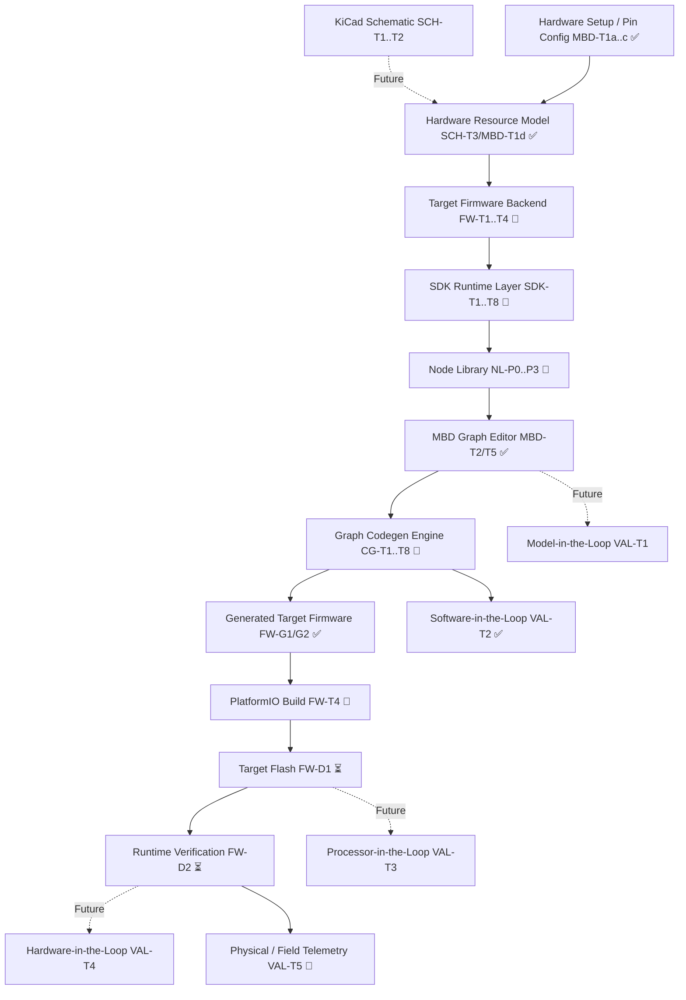

# HyprAccel — Canonical Implementation Plan & Architecture Roadmap

## Background & Architectural Intent

HyprAccel is an industrial IoT edge platform targeting heterogeneous processors and hardware accelerators (ESP32, THEJAS RISC-V SoC, and FPGAs). It merges three toolchain lineages — STM32CubeMX (pin configuration and hardware setup), Simulink+Embedded Coder (graphical model-to-C compilation), and HDL Coder (graph-to-RTL acceleration) — into an open-source model-based design (MBD) environment for embedded systems.

This document establishes the canonical technical roadmap across 11 architectural tracks:
- **CORE**: Hardware descriptors, SDK public headers, routing, and baseline acceleration
- **RTL**: Hardware acceleration cores, Verilator co-simulation, and FPGA interfaces
- **MBD**: Block-diagram data model, canvas editor UX, and pin configuration setup
- **FW**: Target backend firmware, peripheral initialization, and generated project integration
- **SDK**: Embedded runtime primitives, kinematics, controllers, and custom node support
- **NL**: Phased node library catalog, signal processing, and robotics algorithms
- **CG**: Code generation engine, validation rules, and C artifact materialization
- **VAL**: Model-in-the-Loop, Software-in-the-Loop, Processor-in-the-Loop, and Hardware-in-the-Loop validation
- **SCH**: KiCad schematic parsing, netlist extraction, and hardware binding
- **SIM**: Gazebo plant simulation and multi-DOF kinematic bridges
- **PLAT**: Telemetry dashboards, comparative studies, and hardware platforms

---

## Scope Management: Immediate Demo Path vs. Long-Term Roadmap

To prevent future platform features from obscuring the critical delivery path, HyprAccel explicitly separates the **Immediate Demo Scope** from the **Long-Term Platform Roadmap**.

### Immediate Demo Critical Path
```
Hardware Setup (pin_config.html)
    ↓
Target Firmware Backend (ESP32 / hyp_esp32_hw)
    ↓
SDK Runtime (hyprccel.h / hyp_router)
    ↓
P0 Node Library (CordicOp, Publish, SensorInput*, ActuatorOutput*)
    ↓
Graph Code Generation (graph_to_c.js)
    ↓
Generated Firmware Integration (mbd/esp32/generated)
    ↓
Target Build (/api/compile / PlatformIO)
    ↓
Target Flash (/api/flash)
    ↓
Runtime Verification (/api/verify & telemetry)
```
*\*Note: SensorInput and ActuatorOutput require peripheral code generation (`MBD-GAP1`) to complete the immediate path.*

### Long-Term Platform Roadmap (Deferred / Future Phases)
The following advanced capabilities are scheduled for future architectural phases and must **NOT** block or obscure the immediate demo path:
- KiCad schematic file import (`SCH-T1..T7`)
- Full multi-level validation suite (MIL engine `VAL-T1`, PIL co-sim `VAL-T3`, HIL plant stand `VAL-T4`)
- Advanced 6-DOF numerical IK solvers (`NL-R2`)
- Multi-protocol industrial communication stacks (Modbus RTU/TCP, CANopen, EtherCAT `NL-COM`)
- User-defined C/C++ custom code node dynamic compilation engine (`NL-CUSTOM` / `SDK-T8`)
- Multi-SoC Indian silicon hardware backends (THEJAS RISC-V FPGA hardware SPI bridge)

---

## Architectural Dependency Graph



---

## Embedded Toolchain Architecture Comparison: STM32CubeMX vs HyprAccel

HyprAccel draws architectural inspiration from STM32CubeMX / STM32CubeIDE for hardware configuration, but adapts the concept for heterogeneous open hardware (ESP32, THEJAS RISC-V SoC, FPGAs) combined with graphical MBD control generation.

### Feature Comparison Matrix

| Aspect / Peripheral | STM32CubeMX / CubeIDE | HyprAccel Engine | Status / Scope in HyprAccel |
|---|---|---|---|
| **Board / Device Selection** | STM32 MCU family search & database | Board descriptors (`boards.yaml`) for ESP32 & THEJAS RISC-V | Implemented (`CORE-T2`) |
| **Pin Configuration** | Graphical MCU chip pinout selector | Web drag-and-drop pin assignment editor (`pin_config.html`) | Implemented (`MBD-T1a..c`) |
| **GPIO Configuration** | Input/Output/Analog mode, Speed, Pull-up/down | Semantic hardware signal roles (`gpio`, `input`, `output`) | Implemented (`MBD-T1d`, `FW-P1`) |
| **UART Configuration** | Baud rate, parity, stop bits, word length, DMA | Serial peripheral binding (`uart` tx/rx roles) | Implemented (`MBD-T1d`, `FW-P2`) |
| **SPI Configuration** | Master/Slave, CPOL, CPHA, Prescaler, NSS | SPI peripheral binding (`spi` sck/mosi/miso/cs roles) | Implemented (`MBD-T1d`, `FW-P3`) |
| **I2C Configuration** | Standard/Fast mode, Duty Cycle, Addressing | I2C peripheral binding (`i2c` sda/scl roles) | Implemented (`MBD-T1d`, `FW-P4`) |
| **PWM Configuration** | Timer channels, Duty cycle, Frequency, Alignment | PWM output binding (`pwm` output role) | Implemented (`MBD-T1d`, `FW-P5`) |
| **ADC Configuration** | Resolution, Sampling time, Channels, Trigger | ADC input binding (`adc` input role) | Implemented (`MBD-T1d`, `FW-P6`) |
| **Clock-Tree Synthesis** | Interactive RCC PLL, AHB/APB prescaler clock tree synthesizer | **Not Attempted.** Relies on target SDK/framework defaults (Arduino/ESP-IDF/THEJAS BSP) | **Explicitly Out of Scope** |
| **Peripheral Initialization** | Generates `MX_GPIO_Init()`, `MX_USART1_UART_Init()`, `HAL_Init()` | Injects `#define HYP_PIN_*` into `hyp_board_config.h` & `hyp_esp32_hw_init()` | Partial (`FW-T1`, `FW-P1..P6`) |
| **SDK / Driver Abstraction** | STM32 HAL / LL C libraries | HyprAccel C SDK (`hyprccel.h`, `hyp_router.c`, `hyp_esp32.c`, `hyp_thejas.c`) | Implemented (`CORE-T1..T7`) |
| **Application Codegen** | Manual user C code added to `main.c` while (1) loop | Graphical block diagram model graph generating `hyp_graph_<id>_step()` | Implemented (`MBD-T3..T6`, `CG-T1..T6`) |
| **Middleware Integration** | FreeRTOS, LwIP, FatFS, USB Host/Device UI packs | Lightweight runtime router & topic publisher (`hyp_publish`) | Implemented (`CORE-T7`, `PLAT-T1`) |
| **Schematic Hardware Binding** | Manual pin selection or KiCad netlist reference | Future KiCad `.kicad_sch` netlist parser (`SCH-T1..T7`) | Future Architecture (`SCH-T1..T7`) |
| **Build & Flash Workflow** | ST-Link / OpenOCD / STM32CubeProgrammer integration | Express `/api/compile`, `/api/flash`, `/api/verify` PlatformIO wrapper | Partial (`MBD-T9`, `FW-D1..D2`) |

### Architectural Boundary Summary
HyprAccel focuses on **hardware resource modeling + peripheral signal binding + MBD control code generation**. It does **NOT** attempt to reproduce STM32 CubeMX clock-tree/RCC prescaler synthesis. All clocking and system timing configurations rely directly on the target vendor's board support package (BSP) defaults.

---

## Detailed Track Definitions & Current Repository Status

### 1. TRACK FW — Firmware / Target Backend
The target firmware track delivers board startup, peripheral hardware binding, generated project wrapping, and physical flashing/verification.

#### A. Firmware Infrastructure
- **`FW-T1` | ESP32 Target Backend & Initialization**: `Partial`. `sdk/src/hyp_esp32_hw.cpp` / `sdk/include/hyp_esp32_hw.h` provide target initialization stubs (`hyp_esp32_hw_init`).
- **`FW-T2` | Board Configuration Consumption**: `Complete`. `gen_board_config.js` extracts pin assignments from `hardware.json` and injects `#define HYP_PIN_*` into `hyp_board_config.h`.
- **`FW-T3` | Target Startup / Initialization Contract**: `Complete`. Target runtime markers defined in `mbd/esp32/README.md` and Arduino wrapper (`HYPRACCEL_MBD_T9_READY`, `HYPRACCEL_GRAPH_ID=...`, `HYP_PUBLISH topic=...`).
- **`FW-T4` | SDK Target Implementation & Drivers**: `Partial`. C SDK targets ESP32 and THEJAS RISC-V host baselines; hardware driver generation is pending.

#### B. Target Peripheral Implementation
- **`FW-P1` | GPIO Target Initialization & Support**: `Partial`. Macro configuration complete; target driver read/write mapping in progress.
- **`FW-P2` | UART Target Initialization & Support**: `Partial`. Serial TX/RX mapping complete in `boards.yaml`; target hardware initialization stubs present.
- **`FW-P3` | SPI Target Initialization & Support**: `Partial`. SPI SCK/MOSI/MISO/CS mapping complete; hardware bus initialization pending.
- **`FW-P4` | I2C Target Initialization & Support**: `Partial`. I2C SDA/SCL mapping complete; target I2C init pending.
- **`FW-P5` | PWM Target Initialization & Support**: `Partial`. PWM channel/output pin mapping complete; target timer PWM driver pending.
- **`FW-P6` | ADC Target Initialization & Support**: `Partial`. ADC channel/input pin mapping complete; target analog read driver pending.

#### C. Generated Firmware Integration
- **`FW-G1` | Generated Source & Wrapper Materialization**: `Complete`. Express server materializes generated `graph.c`, SDK sources, and Arduino main wrapper into `mbd/esp32/generated/`.
- **`FW-G2` | Target Build Integration**: `Partial`. PlatformIO configuration (`platformio.ini`) and `/api/compile` endpoint implemented; waiting for local host PlatformIO CLI environment.

#### D. Physical Deployment & Verification
- **`FW-D1` | Physical Hardware Flashing**: `Not started`. Blocked on physical CP2102 serial target hardware and host PlatformIO CLI installation.
- **`FW-D2` | Physical Target Runtime Verification**: `Not started`. Blocked on physical flash execution and serial output verification (`/api/verify`).

---

### 2. TRACK SDK — Runtime SDK
The runtime SDK provides embedded primitives required by generated C step functions and block library nodes.

#### Implemented Core Primitives
- **`CORE-T1..T7` | Core SDK Engine**: `Complete`. `hyp_cordic_ref()`, `hyp_cordic_rtl()`, `hyp_router_dispatch()`, and `hyp_publish()` are complete and verified.

#### Runtime Primitives (Specification & Implementation Status)
- **`SDK-T1` | `hyp_sensor_read`**: `Complete` (Antigravity/Sonnet). Resolves canonical `hardwareResourceId` values against generated ESP32 configuration; supports GPIO/ADC/UART reads and reports configured SPI/I2C as explicitly unsupported.
- **`SDK-T2` | `hyp_actuator_write`**: `Complete` (Antigravity/Sonnet). Resolves canonical `hardwareResourceId` values against generated ESP32 configuration; supports GPIO/PWM/UART writes and reports configured SPI/I2C as explicitly unsupported.
- **`SDK-T3` | `hyp_pid_step` & PID State**: `Complete` (Nemotron). Discrete PID controller with anti-windup (conditional integration), output saturation, and persistent state (`hyp_pid_state_t`). Tested in `sdk/test/test_pid.c` (8/8 pass).
- **`SDK-T4` | Kinematics Runtime**: `Not started` (Specification stage). Forward/Inverse kinematics matrix and vector routines.
- **`SDK-T5` | Encoder Runtime**: `Not started` (Specification stage). Quadrature encoder pulse counting and velocity estimation routines.
- **`SDK-T6` | Quaternion & SE(3) Runtime**: `Not started` (Specification stage). 3D orientation math (quaternions, Euler angles, SE(3) transformation matrices).
- **`SDK-T7` | Joint Controller Runtime**: `Not started` (Specification stage). Multi-axis joint position/velocity trajectory controller primitive.
- **`SDK-T8` | Custom-Node Runtime Support**: `Not started` (Specification stage). Extension hooks for embedding user C functions into the graph execution loop.

---

### 3. TRACK NODE LIBRARY — NL
Node implementations are organized into functional phases.

> [!IMPORTANT]
> **Node Catalog ≠ Node Implementation**.
> Adding a node to the schema or UI palette does NOT mean the node is implemented. A node is fully implemented ONLY when ALL 8 steps are complete:
> 1. Graph schema definition
> 2. Canvas palette & inspector UI representation
> 3. Port & data type definitions
> 4. Parameter validation rules
> 5. Graph-to-C code generation (`graph_to_c.js`)
> 6. Underlying SDK/runtime primitive support
> 7. Target hardware backend mapping (where hardware peripherals are involved)
> 8. Unit & integration tests

#### Phased Node Taxonomy
- **`NL-P0` | Foundation Nodes**: `Complete` for `CordicOp`, `Publish`, `SensorInput`, and `ActuatorOutput`; the latter two use the SDK-T1/T2 runtime primitives and graph codegen paths.
- **`NL-P1` | Basic Math & Signal Processing**: `Not started`. `Constant`, `Add`, `Subtract`, `Multiply`, `Gain`, `Clamp`, `Saturation`.
- **`NL-P2` | Control Nodes**: `Complete` for `PID` (ControlLoop). Discrete PID with anti-windup, conditional integration, output saturation; uses SDK-T3 `hyp_pid_step`; graph schema, palette, inspector, ports, validation, codegen, and tests complete. `PI`, `Lead-Lag` remain `Not started`.
- **`NL-R1` | 3-DOF Robotics Foundation**: `Not started`. 3-DOF arm forward/inverse kinematics, joint position/velocity, planar transformations.
- **`NL-4WD` | 4WD / Mobile Robotics**: `Not started`. Wheel encoders, differential drive kinematics, motor speed controllers, odometry.
- **`NL-R2` | 6-DOF Robotics Foundation**: `Not started`. 6-DOF manipulator FK/IK, end-effector pose, SE(3) transform, joint limits.
- **`NL-COM` | Communication & Timing**: `Not started`. UART/SPI/I2C packet I/O, timer tick, delay blocks.
- **`NL-DATA` | Data & Telemetry**: `Partial`. `Publish` topic streaming is complete; data logging buffer blocks are pending.
- **`NL-CUSTOM` | Custom Code Nodes**: `Not started`. User C expression block and header inclusion wrapper.
- **`NL-ADV` | Advanced P2/P3 Nodes**: `Not started`. Specialized DSP filters, matrix solvers, custom RTL hardware accelerator wrappers.

---

### 4. TRACK CODEGEN — CG
The code generation pipeline compiles graphical block diagrams into target-executable C source code.

- **`CG-T1` | Expand Graph Schema**: `Complete`. `mbd/schema/graph.schema.json` defines nodes, ports, parameters, and `hardwareResourceId` regex.
- **`CG-T2` | Node & Port Parameter Validation**: `Complete`. `scratch/test_hardware_model.js` and Express `/api/build` validate node types, pin conflicts, and parameters.
- **`CG-T3` | Node → C Code Generation**: `Complete` for the current P0 nodes; `mbd/codegen/graph_to_c.js` emits SensorInput/ActuatorOutput primitive calls.
- **`CG-T4` | SDK Dependency Resolution**: `Complete`. Injects `#include "hyprccel.h"` and `#include "hyp_board_config.h"` into generated C.
- **`CG-T5` | Generated Source & Header Management**: `Complete`. Materializes source code cleanly into `mbd/esp32/generated/`.
- **`CG-T6` | Generated Firmware Project Integration**: `Complete`. Target main loop calls graph step function at regular execution intervals.
- **`CG-T7` | Generated Project Build Verification**: `Partial`. Host SDK unit tests pass; physical PlatformIO target build verification pending.
- **`CG-T8` | Codegen Error Reporting & Diagnostics**: `Partial`. Schema validation errors returned to editor UI; detailed codegen line diagnostics pending.

> [!WARNING]
> **Critical Code Generation Gap (`MBD-GAP1`)**:
> `SensorInput` and `ActuatorOutput` now emit SDK-T1/T2 calls. Physical peripheral execution remains target-dependent and is not claimed by host tests.

---

### 5. TRACK VALIDATION — MBD Validation Lifecycle (VAL)
HyprAccel defines a formal Model-Based Design validation lifecycle.

```
Graph Model
    ↓
MIL (Model-in-the-Loop: pure math simulation on host)
    ↓
Generated C Code
    ↓
SIL (Software-in-the-Loop: host execution vs golden baseline)
    ↓
Target Binary
    ↓
PIL (Processor-in-the-Loop: target execution via debug co-simulation)
    ↓
Hardware / RTL Integration
    ↓
HIL (Hardware-in-the-Loop: physical target + real-time plant stand)
    ↓
Physical System Deployment & Telemetry
```

#### Status Classification
- **`VAL-T1` | Model-in-the-Loop (MIL)**: `Not started` (Future Roadmap). Pure host-side math model simulation before code generation.
- **`VAL-T2` | Software-in-the-Loop (SIL)**: `Complete` (Current). Host-side reference C test (`test_cordic_ref.c`) and host Verilator backend simulation (`test_cordic_rtl_backend.cpp`) validate generated code against golden mathematical models.
- **`VAL-T3` | Processor-in-the-Loop (PIL)**: `Not started` (Future Roadmap). Co-simulating target processor execution via JTAG/GDB debug interface against host simulation.
- **`VAL-T4` | Hardware-in-the-Loop (HIL)**: `Not started` (Future Roadmap). Executing target firmware against real-time physical plant simulators.
- **`VAL-T5` | Physical / Field Validation**: `Partial` (Partially Available). Web telemetry dashboard (`PLAT-T1`) and server `/api/verify` serial log validation implemented; physical test stand pending.

---

### 6. TRACK SCHEMATIC — Schematic Integration (SCH)
Future workflow for binding KiCad schematics directly to HyprAccel hardware setup.

```
KiCad Schematic (.kicad_sch)
    ↓
Net & Symbol Extraction (SCH-T1, SCH-T2)
    ↓
MCU Pin & Peripheral Resolution (SCH-T3a..c)
    ↓
Hardware Resource Model Generation (SCH-T4a..b)
    ↓
Hardware Setup Validation (SCH-T5..T6)
    ↓
MBD Node Resource Binding (SCH-T7)
```

- **`SCH-T1` | KiCad .kicad_sch Parser**: `Not started` (Future Roadmap).
- **`SCH-T2` | Symbol & Net Extraction Engine**: `Not started` (Future Roadmap).
- **`SCH-T3` | MCU Pin & Peripheral Resolution**: `Not started` (Future Roadmap).
- **`SCH-T4` | Schematic → Hardware Resource Model**: `Not started` (Future Roadmap).
- **`SCH-T5` | Conflict & Unconnected Pin Detection**: `Not started` (Future Roadmap).
- **`SCH-T6` | Schematic ↔ Hardware Setup Consistency**: `Not started` (Future Roadmap).
- **`SCH-T7` | MBD Node → Schematic Resource Binding**: `Partial`. Hardware resource ID binding is implemented in graph editor and schema (`hardwareResourceId`); schematic parsing input is Future Roadmap.
- **`SCH-T8` | EasyEDA .tel Netlist Import**: `Partial`. EasyEDA `.tel` adapter and ESP32 pad→GPIO recovery are implemented; fixture-backed verification against `Netlist_Schematic1_2026-08-18.tel` is pending until the real file is available in the workspace.
- **`SCH-T9` | Expose Schematic Import to Hardware Setup UI**: `Complete`. Added preview and apply workflow in pin_config.html, bridging SCH-T1..T8 pipeline to canonical hardware model.

---

---\n\n## 9. TRACK HW-UX — Hardware Setup UX v2\n\n*Evolve the current flat pin-configuration UI into a structured, resource-oriented engineering workflow. Reuses the canonical hardware resource model (MBD-T1d) and schematic import backend (SCH-T1..T4).*

### 9.1 Purpose & Scope\n\nThis track addresses the next phase of Hardware Setup UX evolution. The current implementation (`MBD-T1a..c`, `MBD-T1d`) provides a functional but flat pin-assignment interface. This track restructures it into a professional engineering-tool workflow:\n\n```\nBoard\n  ↓\nPeripheral / Hardware Resource\n  ↓\nSemantic Signals\n  ↓\nPhysical Pins\n```\n\n**Example:**\n```\nESP32-WROOM-32\n  └── SPI / HSPI\n       ├── SCK  → GPIO14\n       ├── MOSI → GPIO13\n       ├── MISO → GPIO12\n       └── CS   → GPIO15\n```\n\n### 9.2 Architectural Boundary\n\n| Layer | Responsibility | Source of Truth |\n|-------|---------------|-----------------|\n| **Hardware Setup** | Board → peripherals/resources → semantic signals → physical pins | Canonical Hardware Resource Model (`MBD-T1d`) |\n| **Graph Editor** | Application/model logic → node connections → execution/backend selection | Graph schema + shared project hardware state |\n| **Codegen** | Hardware model + graph → generated deployable firmware/project | Graph schema + canonical hardware resource model |\n\n**Hard Rules:**\n- Hardware Setup UI must NOT become a second graph editor.\n- Graph nodes must NOT become the source of truth for physical pin assignment.\n- The canonical hardware resource model (`MBD-T1d`) remains the single source of truth for peripheral/signal/pin definitions.\n- The existing schematic import backend (`SCH-T1..T4`) feeds the canonical model — it does NOT create a second configuration system.\n\n### 9.3 Schematic Relationship Workflow\n\n```\nManual Hardware Configuration\n             OR\n       KiCad .kicad_sch\n             ↓\n      Canonical Hardware\n          Resource Model\n             ↓\n       Hardware Setup UI\n             ↓\n          Graph Editor\n             ↓\n           Codegen\n             ↓\n       Target Firmware\n```\n\nThe existing `SCH-T1..T4` implementation remains the backend foundation. Schematic import tasks are NOT complete merely because the backend importer exists.\n\n### 9.4 Scope Boundary (Explicitly Deferred)\n\nThis is **NOT** the large IDE/workspace redesign. The following are explicitly deferred:\n- Word-like document workspace\n- Full project explorer\n- Multi-file code editor\n- Large IDE menu system\n- Full Simulink-style workspace\n- Extensive dashboard redesign\n\nThese can be added later when the node library has sufficient depth. This phase is specifically **Hardware Setup UX and its integration with project state**.\n\n### 9.5 Task Definitions\n\n| Task | Description | Dependencies |\n|------|-------------|--------------|\n| **HW-UX-T1** | **Hardware Setup v2 foundation / resource grouping**<br>Transform the flat hardware-resource configuration UI into a structured hierarchy: Board → Peripheral/Resource → Semantic Signals → Physical Pins. Reuse existing canonical hardware resource model (`MBD-T1d`). | `MBD-T1d` (Complete) |\n| **HW-UX-T2** | **Peripheral / semantic signal sections**<br>Organize Hardware Setup into sections: GPIO, SPI, I2C, UART, PWM, ADC. Display signals under relevant resource instead of unrelated pin dropdowns. Preserve existing semantic signal role definitions. | `HW-UX-T1`, `MBD-T1d` |\n| **HW-UX-T3** | **Project target board selector integration**<br>Make selected target board project-level state shared consistently by Hardware Setup, Graph Editor, Code Generation, and Build/Deploy backend. Fix existing target-board propagation bug (Graph Editor showing THEJAS32 when Hardware Setup selected ESP32-WROOM-32). | `MBD-T1a..c`, `MBD-T5` (Graph Editor) |\n| **HW-UX-T4** | **KiCad schematic import UI**<br>Expose existing `SCH-T1..T4` importer through Hardware Setup. Provide workflow: "Manual Configuration" OR "Import KiCad Schematic" (.kicad_sch input). Importer feeds canonical hardware resource model. | `SCH-T1..T4` (Complete), `HW-UX-T1` |\n| **HW-UX-T5** | **Schematic import preview and apply workflow**<br>Before applying imported config, show: detected MCU, detected resources, semantic signals, resolved pins, warnings/errors. Allow review and apply. Do not replace manual configuration. | `HW-UX-T4` |\n| **HW-UX-T6** | **Pinout visualization / CubeMX-style board view**<br>Add visual representation of selected board: physical pins, assigned peripherals, semantic signal roles, conflicts, available/unassigned pins. Purpose: visual hardware configuration and validation. | `HW-UX-T1`, `HW-UX-T2` |\n| **HW-UX-T7** | **Hardware Setup ↔ Graph Editor integration polish**<br>Ensure graph editor consumes same canonical project hardware state. Hardware resources configured in Hardware Setup must be available to graph nodes. Graph references hardware resources rather than independently redefining physical pin mappings. | `HW-UX-T3`, `MBD-T5` |\n| **HW-UX-T8** | **Hardware Setup validation/error UX**<br>Surface existing canonical validation rules clearly in UI: duplicate pin assignment, invalid signal role, invalid pin/signal combination, unknown resource, unconfigured resource, unresolved schematic MCU, conflicting resource assignments. Do not create second validation engine. | `HW-UX-T1`, `MBD-T1d` |\n\n### 9.6 Dependency Graph Additions\n\n```mermaid\ngraph TD\n    %% Existing SCH backend\n    SCH_T1T4[SCH-T1..T4 ✅] --> HW_UX_T4[HW-UX-T4]\n    \n    %% Existing Hardware Model\n    MBD_T1d[MBD-T1d ✅] --> HW_UX_T1[HW-UX-T1]\n    MBD_T1d --> HW_UX_T2[HW-UX-T2]\n    MBD_T1d --> HW_UX_T8[HW-UX-T8]\n    \n    %% HW-UX internal deps\n    HW_UX_T1 --> HW_UX_T2\n    HW_UX_T1 --> HW_UX_T6\n    HW_UX_T1 --> HW_UX_T8\n    HW_UX_T4 --> HW_UX_T5\n    HW_UX_T3 --> HW_UX_T7\n    HW_UX_T2 --> HW_UX_T6\n    \n    %% Integration with Graph Editor & Codegen\n    HW_UX_T3 -. Board State .-> MBD_T5[MBD-T5 Graph Editor ✅]\n    HW_UX_T7 -. Shared HW State .-> MBD_T5\n    MBD_T5 -. Graph Nodes .-> CG_T3[CG-T3 Codegen]\n    \n    %% Build/Deploy\n    HW_UX_T3 -. Board State .-> FW_G2[FW-G2 Build Integration]\n```\n\n---\n\n## TRACK SIM — Plant Simulation & Gazebo
- **`SIM-T1` | Gazebo 6-DOF Arm URDF**: `Not started`.
- **`SIM-T2` | Kinematics Definition**: `Not started`.
- **`SIM-T3` | HyprAccel → Gazebo Bridge**: `Not started`.
- **`SIM-T4` | HW CORDIC in Simulation Bridge**: `Not started`.
- **`SIM-T5` | Surgical Framing**: `Deferred`.
- **`SIM-T6` | N-Point Stress Test**: `Deferred`.

*Relationship to Validation*: Gazebo is a **plant simulation environment** used within MIL/SIL/HIL validation modes. Gazebo integration does not substitute for physical HIL hardware execution.

---

### 8. TRACK PLATFORM — Telemetry & Tooling
- **`PLAT-T1` | Telemetry Dashboard**: `Complete`. Web dashboard for real-time serial telemetry visualization.
- **`PLAT-T2` | Siemens S7 / TIA Portal Architecture Study**: `Complete`. Documented lineage and structural comparison.
- **`PLAT-T3` | Bare Carrier PCB Design**: `Deferred`.

---

## 10. TRACK DESK — Workspace & IDE Integration (DESK)
- **`DESK-T1` | Project Workspace / deployable project viewer**: `Complete`. Implemented persistent view/orchestration layer presenting generated source tree, hardware config, graph, and build/flash controls without duplicating PlatformIO logic.
- **`DESK-T2` | Persistent graph storage and versioning**: `Planned`.
- **`DESK-T3` | Telemetry dash for live hardware monitoring**: `Planned`.

---

## Verification Plan

### Automated Regression & Sanity Tests
- SDK & CORDIC C reference: `nix develop --command make -C sdk/test test`
- Hardware Signal Model: `nix develop --command node scratch/test_hardware_model.js`
- Format & syntax check: `git diff --check`

### Manual Verification
- Graph Editor UX: Launch `mbd/editor/server.js`, navigate to `/graph_editor.html`, test node creation, deletion, undo/redo, pin mapping inspector, and C code generation via `/api/build`.
