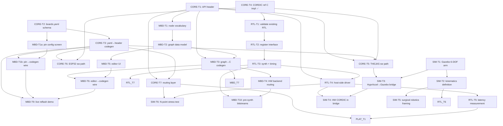

# HyprAccel — Implementation Plan

## Background

HyprAccel is an industrial IoT edge platform targeting Indian silicon (THEJAS/Aries CPU + FPGA). It merges three toolchain lineages — STM32CubeMX (pin config), Simulink+Embedded Coder (graph→C), and HDL Coder (graph→RTL) — into one open tool generating code for Indian boards.

This plan covers the parallel execution structure across all four tracks: **CORE**, **RTL**, **MBD**, and **SIM/PLATFORM**. Tasks with no unmet dependencies are workable immediately, in parallel.

---

## Track Dependency Graph



---

## Parallel Start Set (no dependencies)

These can all begin **right now**, simultaneously:

| Task | Description |
|---|---|
| **CORE-T1** | `hyprccel.h` API header |
| **CORE-T2** | `boards.yaml` schema + THEJAS/ESP32 pinout |
| **CORE-T4** | CORDIC reference C implementation ← **doing this now** |
| **MBD-T1** | Node vocabulary definition |
| **MBD-T2** | Graph JSON schema |
| **MBD-T8** | Three-lineages comparison slide |
| **SIM-T1** | Gazebo 6-DOF arm URDF |
| **PLAT-T2** | Siemens/TIA comparison one-pager |
| **PLAT-T3** | Bare carrier PCB |

---

## File Layout (proposed)

```
HyprAccel/
├── sdk/
│   ├── include/
│   │   └── hyprccel.h                 ← CORE-T1
│   ├── src/
│   │   ├── hyp_cordic_ref.c           ← CORE-T4 ✅ (implementing now)
│   │   ├── hyp_thejas.c               ← CORE-T5
│   │   ├── hyp_esp32.c                ← CORE-T6
│   │   └── hyp_router.c               ← CORE-T7
│   └── test/
│       └── test_cordic_ref.c          ← CORE-T4 test harness ✅
├── boards/
│   ├── boards.yaml                    ← CORE-T2
│   └── codegen/
│       └── gen_board_config.py        ← CORE-T3
├── rtl/
│   ├── cordic.v                       ← RTL-T1 (existing, adapt)
│   ├── reg_interface.v                ← RTL-T2
│   └── tb/
│       └── tb_cordic.v                ← RTL-T1 testbench
├── mbd/
│   ├── nodes/                         ← MBD-T1
│   ├── schema/                        ← MBD-T2
│   ├── codegen/                       ← MBD-T3/T4
│   └── editor/                        ← MBD-T5 (web canvas)
└── sim/
    ├── urdf/                          ← SIM-T1
    └── bridge/                        ← SIM-T3
```

---

## CORE-T4 Implementation Detail (current task)

### Files to create

#### [NEW] `sdk/src/hyp_cordic_ref.c`
- Pure rotation-mode iterative CORDIC (no shortcuts, no LUT replacement)
- **Fixed-point internal representation**: Q1.15 (16-bit signed, 1 sign + 15 fractional bits) to match realistic hardware
- Number of iterations: **16** (matches a 16-bit pipeline in RTL)
- Pre-computed angle table: `atan(2^-i)` for i = 0..15, stored as Q1.15
- Gain factor K pre-applied to initial vector
- External interface: `float` in/out for usability
- All internal math: integer arithmetic only (no floats in the loop — intentional, mirrors hardware)
- Heavily commented: each step labelled so RTL author can find the corresponding hardware stage

#### [NEW] `sdk/test/test_cordic_ref.c`
- `--test` mode: sweep 0–360° in 1° steps, compare against `math.h`, print max/mean absolute error
- `--bench N` mode: run N iterations of `hyp_cordic_ref()` at a random angle, print total wall-clock time and ns/call
- Self-contained, links only against `hyp_cordic_ref.c` and standard C libs
- Exit code 0 on pass, 1 on error (max error > 1e-3 threshold)

#### [NEW] `sdk/test/Makefile`
- `make test` — build and run test mode
- `make bench N=1000000` — build and run bench mode

### Design decisions

1. **Q1.15 not Q0.15**: We need to represent the CORDIC gain factor (≈0.6073) and intermediate rotations, all bounded by [-1, 1], so Q1.15 (range [-1, 1)) is the right format. This matches 16-bit fixed-point DSP and is directly mirrored in Verilog as `signed [15:0]`.
2. **16 iterations**: Each iteration adds ~1 bit of precision. 16 iterations → ~16-bit accuracy, well within float32's mantissa. RTL can be built as a 16-stage pipeline.
3. **No float in the inner loop**: Forces the implementation to mirror what hardware does. Float→fixed conversion happens once on entry; fixed→float on exit.
4. **Gain pre-applied**: K ≈ 0.6073 applied to the initial (x=1, y=0) vector before iteration, so the output doesn't need post-scaling — same as most hardware CORDIC implementations.

---

## Open Questions

> [!IMPORTANT]
> **Q1: THEJAS connectivity** — Does THEJAS talk to the FPGA over SPI or a parallel bus? This determines RTL-T2's register interface design and CORE-T7's routing layer.

> [!IMPORTANT]
> **Q2: Existing RTL codebase** — Where is the existing CORDIC RTL? Is it in this repo or a separate one? RTL-T1 needs access to adapt it against CORE-T4's reference values.

> [!NOTE]
> **Q3: MBD editor host** — Will MBD-T5's web editor run as a local dev server (localhost) during the demo, or does it need to be a static file that runs without a server? Affects the build setup.

> [!NOTE]
> **Q4: FPGA board** — The plan says "Xilinx tooling" — which specific board? (Artix-7, Zynq, etc.) Matters for RTL-T3 timing constraints and bitstream format.

---

## Verification Plan

### CORE-T4
- `make test` must exit 0 with max error < 1e-3 vs `math.h`
- `make bench N=10000000` establishes the software baseline latency number used in RTL-T5 comparison

### Future tracks
- RTL-T1 testbench driven by CORE-T4 golden values (same angle sweep, same tolerance)
- MBD-T3 codegen output must compile cleanly against `hyprccel.h`
- Full integration tested via MBD-T9 rehearsal runs (5× back-to-back)
